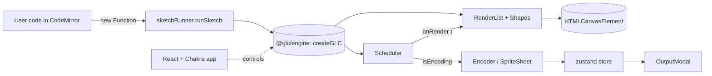

## Target repo layout

```
gifloopcoder/
  package.json                     # root, pnpm workspaces, Volta pin
  pnpm-workspace.yaml
  tsconfig.base.json
  .prettierrc, .prettierignore
  .editorconfig, .gitignore
  .nvmrc                           # mirrors Volta pin
  README.md
  playwright.config.ts             # root-level e2e config
  .github/workflows/
    ci.yml                         # lint + typecheck + unit + build + e2e
    deploy-docs.yml                # build & publish VitePress to gh-pages
  packages/
    engine/                        # pure library, no DOM/UI
      package.json                 # name: "@glc/engine", "type": "module"
      tsconfig.json
      vite.config.ts               # library mode, ESM + d.ts
      vitest.config.ts
      src/
        index.ts                   # public API: createGLC(canvas, opts)
        core/{Scheduler,GLCInterface}.ts
        render/{RenderList,Styles,Interpolation,Color,ColorParser,ValueParser}.ts
        render/shapes/*.ts         # one per existing shape
        encode/{Encoder,SpriteSheet}.ts
        encode/gif/{GIFEncoder,LZWEncoder,NeuQuant}.ts   # ported, not vendored at runtime
        types.ts
      tests/*.test.ts
    app/                           # React + Chakra studio
      package.json                 # depends on "@glc/engine": "workspace:*"
      index.html
      vite.config.ts               # @vitejs/plugin-react, alias @glc/engine
      tsconfig.json
      src/
        main.tsx, App.tsx, theme.ts
        store/glcStore.ts          # zustand
        components/{Toolbar,CodeEditor,CanvasPanel,Splitter,
                    PropertiesPanel,OutputModal,AboutModal}.tsx
        hooks/useGLC.ts
        sketchRunner.ts            # safely evaluate user code
      e2e/*.spec.ts                # Playwright specs
  docs/                            # VitePress
    package.json
    .vitepress/config.ts
    index.md, intro.md, objects.md, properties.md, styles.md, tips.md
    public/images/*                # moved from src/docs/images
  examples/                        # kept as-is, sketches still use onGLC()
```

## Tooling and pinned versions (caret ranges)

- Volta: `node@20.18.x`, `pnpm@9.x` (also `.nvmrc`)
- Build: `vite ^5`, `@vitejs/plugin-react ^4`, `vite-plugin-dts ^4`
- TypeScript: `typescript ^5.5` (loose engine config: `strict: false`, `noImplicitAny: false`; strict in app)
- React: `react ^18`, `react-dom ^18`
- UI: `@chakra-ui/react ^2.8`, `@emotion/react ^11`, `@emotion/styled ^11`, `framer-motion ^11`
- Editor: `@uiw/react-codemirror ^4`, `@codemirror/lang-javascript ^6`, `@codemirror/theme-one-dark ^6`
- Icons: `@fortawesome/react-fontawesome ^0.2`, `@fortawesome/fontawesome-svg-core ^6`, `@fortawesome/free-solid-svg-icons ^6` (replaces all PNGs in `app/icons/`, `src/icons/`, and the old Ionicons reference)
- State: `zustand ^4`
- Tests: `vitest ^2`, `@vitest/coverage-v8 ^2`, `@testing-library/react ^16`, `jsdom ^25`, `@playwright/test ^1.47`
- Lint/format: `prettier ^3`, `eslint ^9` (flat config) + `@typescript-eslint ^8` + `eslint-plugin-react ^7` + `eslint-plugin-react-hooks ^5`
- Docs: `vitepress ^1.4`

## Engine package (`packages/engine`)

- Port every file under [src/src/app/](src/src/app) and [src/src/utils/](src/src/utils) to TS modules with ESM `import/export`. Drop `define(function(require) { ... })` AMD wrappers.
- Replace AMD module names (e.g. `app/render/shapes/circle`) with relative imports.
- Convert `var` to `let`/`const`, replace `event.keyCode` with `event.key`, drop `-webkit-/-moz-/-o-/-ms-` shadow/filter prefixes.
- Public API surface (replaces the implicit `glcConfig` + `window.onGLC` plumbing):

```ts
export interface GLCOptions { canvasWidth?: number; canvasHeight?: number }
export interface GLC { /* loop, playOnce, size, setDuration, setFPS,
  setMode, setEasing, setMaxColors, setQuality,
  styles, renderList, color, w, h, canvas, context,
  onEnterFrame?, onExitFrame? */ }
export function createGLC(canvas: HTMLCanvasElement, opts?: GLCOptions): GLC
```

- Internally keep `RenderList` / `Scheduler` / `Encoder` / `SpriteSheet` / `Interpolation` / `Styles` semantics unchanged so existing sketches in [examples/](examples) still run unmodified.
- Drop `glclauncher.js`, `src/build.js`, `src/build.sh`, `src/src/main.js` (replaced by `createGLC`), and the entire vendored `src/src/libs/codemirror/` and `src/src/libs/require.js` directories.
- Build with Vite library mode → emits `dist/index.js` (ESM) + `dist/index.d.ts`. The app consumes the package via `workspace:*`, so no separate publish step is required for local dev.

## App package (`packages/app`)

- React 18 root rendered into `#root` by `main.tsx` with `<ChakraProvider theme={theme}>`. Theme uses Chakra defaults plus a minimal config (color mode = system, light grey panels, mono font for editor).
- Component map (1:1 with existing controllers/views, but composed declaratively):
  - `Toolbar.tsx` — Chakra `HStack` of `IconButton`s using FA icons (`faPlay`, `faPause`, `faRedo`, `faFile`, `faFolderOpen`, `faSave`, `faPlayCircle`, `faImage`, `faCamera`, `faTh`, `faQuestionCircle`). Owns keyboard shortcuts via a single `useEffect` listener using `event.key`/`event.ctrlKey || event.metaKey`.
  - `CodeEditor.tsx` — wraps `@uiw/react-codemirror` with JavaScript mode, autocloseBrackets, line numbers; persists to `localStorage` under `glcCode`.
  - `CanvasPanel.tsx` — renders the `<canvas>` and a Chakra `Slider` scrubber. Calls `useGLC()` to get the engine instance bound to its canvas ref.
  - `Splitter.tsx` — replaces drag splitter with Chakra layout + a thin draggable handle (pointer events, no kludge).
  - `PropertiesPanel.tsx` — Chakra `Slider`, `Select`, `Checkbox` for duration/FPS/maxColors/mode/easing.
  - `OutputModal.tsx`, `AboutModal.tsx` — Chakra `Modal` (replaces the manual `.overlay` / `.blur` / Esc-handler kludges).
- `store/glcStore.ts` (zustand) holds: code text, GLC settings, status (idle/playing/encoding), latest output dataURL, modal visibility.
- `sketchRunner.ts`:

```ts
export function runSketch(code: string, glc: GLC) {
  const factory = new Function(`${code}\nreturn typeof onGLC === 'function' ? onGLC : null;`);
  const onGLC = factory();
  if (onGLC) onGLC(glc);
}
```

  This keeps the existing `function onGLC(glc) { ... }` sketch convention (so [examples/](examples) and user files still work) while replacing the `<script>` injection hack and `window.onGLC` global.
- External-editor mode: when `?external=1` (or `VITE_GLC_EXTERNAL=1`) is set, the editor pane and code-related toolbar buttons are hidden; the host page can `import { createGLC } from "@glc/engine"` and run their own sketch directly. This replaces the legacy `glcConfig.externalEditor` + `<script src="path/to/sketch.js">` flow and is documented as the new pattern.

## Docs (`docs/` via VitePress)

- Move [src/docs/*.md](src/docs) and [src/docs/images/](src/docs/images) into `docs/` and `docs/public/images/`.
- `.vitepress/config.ts` configures site title, sidebar (Intro, Objects, Properties, Styles, Tips), `base: '/gifloopcoder/'` for project pages.
- Delete `src/build.sh` (the Pandoc invocations) and `src/docs/main.css` (Pandoc header).
- Delete the prebuilt `docs/*.html` and `docs/index.html` once the VitePress build replaces them; keep `GLCCheatSheet.pdf` under `docs/public/`.
- `.github/workflows/deploy-docs.yml`: runs on push to `master` affecting `docs/**`, runs `pnpm --filter docs build`, deploys `docs/.vitepress/dist` to `gh-pages` via `actions/deploy-pages`.

## Tests

- Unit (`vitest`, run from each package):
  - engine: `ValueParser` (number/string/bool/array tweening), `ColorParser` (hex/rgb/rgba/named/gradient), `Color` (rgb/hsv math), `Interpolation` (bounce/single × easing on/off), `Styles.reset`, `RenderList.add`/`clear`/parent nesting, `Scheduler` advance/loop using fake timers, `SpriteSheet.start` size math.
  - app: `sketchRunner` happy-path + syntax error, store reducers, a smoke render test for `Toolbar` and `PropertiesPanel` via Testing Library.
- E2E (`@playwright/test` in `packages/app/e2e/`):
  - Loads the app, default sketch compiles, canvas pixel data is non-empty after a tick.
  - Clicking Loop → Pause toggles status; Ctrl/Cmd+Enter recompiles edited code.
  - Make GIF flow: click "GIF", wait for output modal, assert image `src` starts with `data:image/gif;base64,`.

## Cleanup checklist (legacy artifacts to delete)

- [src/build.sh](src/build.sh), [src/build.js](src/build.js)
- `src/src/libs/codemirror/**` (entire vendored editor)
- `src/src/libs/require.js`, [src/src/glclauncher.js](src/src/glclauncher.js), [src/src/main.js](src/src/main.js)
- [src/glc-min.js](src/glc-min.js) and [app/glc-min.js](app/glc-min.js) (replaced by Vite build output)
- [src/styles/codemirror.css](src/styles/codemirror.css), [app/styles/codemirror.css](app/styles/codemirror.css)
- [src/icons/](src/icons), [app/icons/](app/icons) (replaced by FontAwesome)
- [src/docs/main.css](src/docs/main.css) and the generated [docs/*.html](docs) files
- `-webkit-/-moz-/-o-/-ms-` vendor prefixes; `event.keyCode`; `var alert/confirm/prompt` (replaced with Chakra modals/toasts)
- The whole nested `src/src/` layout (flattened into `packages/engine` and `packages/app`)

## README updates

- Replace the Pandoc/RequireJS instructions with: `volta install node@20 pnpm@9` → `pnpm install` → `pnpm dev` (runs the app), `pnpm build`, `pnpm test`, `pnpm e2e`, `pnpm docs:dev`.
- Document the two consumption modes: (1) studio app at the GitHub Pages URL, (2) embedding `@glc/engine` directly with `createGLC(canvas)`.

## High-level data flow (new)

